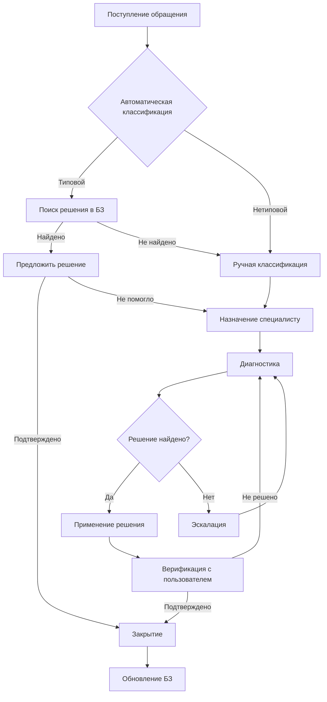

Процесс обработки инцидентов — восстановление нормальной работы сервиса с минимальным влиянием на бизнес.

## SIPOC

| Элемент | Описание |
|---------|----------|
| **Supplier** | Пользователь, Система мониторинга, Email-шлюз |
| **Input** | Обращение (описание проблемы, контактные данные, приоритет) |
| **Process** | Регистрация → Классификация → Назначение → Диагностика → Решение → Закрытие |
| **Output** | Решённый инцидент, Обновлённая база знаний, Отчёт |
| **Customer** | Пользователь, Менеджер услуг, Руководство |

## Диаграмма процесса

## Шаги процесса

### 1. Регистрация

- Автоматическое создание тикета из всех каналов
- Идентификация пользователя и его контекста
- Присвоение уникального номера

### 2. Классификация

- Определение категории и типа инцидента
- Автоматический приоритет на основе влияния и срочности
- Маршрутизация на соответствующую группу

### 3. Диагностика

- Анализ симптомов
- Поиск аналогичных инцидентов
- Определение root cause

### 4. Решение

- Применение известного решения или workaround
- Документирование действий
- Верификация с пользователем

### 5. Закрытие

- Подтверждение решения пользователем
- Обновление базы знаний
- Формирование отчётности

## Роли в процессе

| Роль | RACI | Задачи |
|------|------|--------|
| Пользователь | I | Сообщает о проблеме, подтверждает решение |
| Специалист 1-й линии | R | Регистрация, классификация, типовые решения |
| Специалист 2-й линии | R | Сложная диагностика, нетиповые решения |
| Менеджер процесса | A | Контроль SLA, эскалации, улучшения |
| Менеджер услуг | C | Приоритизация, ресурсы |

## KPI

| Метрика | Описание | Целевое значение |
|---------|----------|------------------|
| **FCR** | First Contact Resolution — решение при первом обращении | > 70% |
| **MTTR** | Mean Time To Resolve — среднее время решения | < 4 часа (P2) |
| **CSAT** | Customer Satisfaction — удовлетворённость | > 4.5/5 |
| **Reopen Rate** | Доля повторно открытых инцидентов | < 5% |
