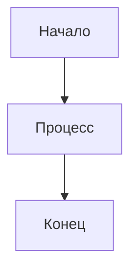

# Блоки Gramax

Детальная документация XML-блоков и токенов Gramax.

## Заметки (Notes)

Callout-блоки с разными типами:

```markdown
<note type="tip" title="Заголовок" collapsed="false">

Содержимое заметки.

</note>
```

**Типы:**
| type | Назначение |
|------|------------|
| `tip` | Полезный совет |
| `info` | Информация |
| `hotfixes` | Важное предупреждение |
| `quote` | Цитата |
| `lab` | Экспериментальное |

**Параметры:**
- `title` — заголовок (опционально)
- `collapsed` — свёрнута по умолчанию (true/false)

**Важно:** Сохраняй пустые строки после открывающего и перед закрывающим тегом.

## Табы (Tabs)

Переключаемые вкладки:

```markdown
<tabs>

<tab name="Python">

Код на Python.

</tab>

<tab name="JavaScript">

Код на JavaScript.

</tab>

</tabs>
```

**Правила:**
- Каждый `<tab>` должен иметь атрибут `name`
- Пустые строки внутри табов обязательны
- Первый таб активен по умолчанию

## Вью (Views)

Автоматический список дочерних страниц:

```markdown
<view defs="hierarchy=none" display="List"/>
```

**Параметры defs:**
- `hierarchy=none` — плоский список без вложенности

**Параметры display:**
- `List` — вертикальный список

Размещай на отдельной строке в `_index.md` разделов.

## Сниппеты (Snippets)

Переиспользуемые фрагменты из `.gramax/snippets/`:

```markdown
<snippet id="common-warning"/>
```

**Структура:**
```
.gramax/
└── snippets/
    └── common-warning.md
```

Сниппет — обычный markdown-файл без frontmatter.

## Таблицы

### Markdown-таблицы (рекомендуется)

```markdown
| Колонка | Тип | Обязательно |
|---------|-----|-------------|
| id | number | да |
| name | text | нет |
```

### Gramax-таблицы (визуальный редактор)

Создаются редактором, не переформатируй:

```markdown
<table header="row">
<tr>
<td>

Заголовок

</td>
<td>

Значение

</td>
</tr>
</table>
```

**Правило:** Если в репо используются `<table>`, сохраняй формат как есть, включая пустые строки внутри `<td>`.

## OpenAPI

Встраивание спецификации API:

```markdown
<openapi src="./api.yaml" flag="true"/>
```

**Параметры:**
- `src` — путь к YAML/JSON файлу
- `flag` — показывать флаг deprecated (true/false)

## Mermaid

Диаграммы из внешнего файла:

```markdown
<mermaid path="./diagram.mermaid" width="800px" height="450px"/>
```

**Файл diagram.mermaid:**


## Видео

Встраивание видео по URL:

```markdown
<video path="https://youtube.com/watch?v=..."/>
```

## HTML

Сырой HTML-код:

```markdown
<html>
<div class="custom">
  Произвольный HTML
</div>
</html>
```

## Иконки

Lucide-иконки:

```markdown
<icon code="lucide-check"/>
```

Список иконок: https://lucide.dev/icons

## Изображения

### Простые изображения

```markdown
{width=800 height=450}
```

### XML-формат (с кропами/аннотациями)

```markdown
<image src="./image.png" crop="..." objects="..." width="800" height="450" float="center"/>
```

Не редактируй числовые параметры `crop` и `objects` вручную — они генерируются редактором.

## Комментарии

Система комментариев Gramax состоит из двух частей: разметка в .md файле и данные в .comments.yaml.

### Инлайн-комментарий

```markdown
Текст с <comment id="abc12">выделенным фрагментом</comment>.
```

### Блочный комментарий

```markdown
[comment:abc12]

Блок текста с комментарием.

[/comment]
```

### Файл комментариев (.comments.yaml)

Для каждой страницы с комментариями создаётся файл `*.comments.yaml`:
- `page.md` → `page.comments.yaml`
- `_index.md` → `_index.comments.yaml`

**Структура:**

```yaml
abc12:
  comment:
    dateTime: '2026-01-30T14:22:47.567Z'
    user:
      mail: author@example.com
      name: Имя Автора
    content: Текст основного комментария
  answers:
    - user:
        mail: reviewer@example.com
        name: Имя Рецензента
      dateTime: '2026-01-30T14:30:00.000Z'
      content: Текст ответа на комментарий
    - user:
        mail: author@example.com
        name: Имя Автора
      dateTime: '2026-01-30T14:35:00.000Z'
      content: Текст второго ответа
```

**Поля:**
| Поле | Формат | Описание |
|------|--------|----------|
| ID (ключ) | 5 символов, a-zA-Z0-9 | Уникальный ID комментария |
| `dateTime` | ISO 8601 | Дата и время в UTC |
| `user.mail` | email | Email автора |
| `user.name` | string | Имя автора |
| `content` | string | Текст комментария |
| `answers` | array | Массив ответов (опционально) |

### Операции с комментариями

#### Добавить комментарий

1. Сгенерируй ID (5 символов alphanumeric)
2. Вставь разметку в .md: `<comment id="XXXXX">текст</comment>`
3. Создай/обнови .comments.yaml:

```yaml
XXXXX:
  comment:
    dateTime: '2026-01-30T15:00:00.000Z'
    user:
      mail: user@example.com
      name: Имя Пользователя
    content: Текст комментария
  answers: []
```

#### Ответить на комментарий

Добавь элемент в `answers`:

```yaml
XXXXX:
  comment:
    # ... существующий комментарий
  answers:
    # ... существующие ответы
    - user:
        mail: responder@example.com
        name: Имя Отвечающего
      dateTime: '2026-01-30T16:00:00.000Z'
      content: Текст ответа
```

#### Редактировать комментарий

Измени поле `content` в .comments.yaml:

```yaml
XXXXX:
  comment:
    dateTime: '2026-01-30T15:00:00.000Z'  # не менять
    user:
      mail: user@example.com              # не менять
      name: Имя Пользователя              # не менять
    content: Новый текст комментария      # ← изменить
  answers: [...]
```

**Важно:** Не меняй `dateTime`, `user` — они фиксируют оригинального автора и время.

#### Удалить комментарий

1. Убери тег `<comment id="XXXXX">...</comment>` из .md
2. Удали ключ `XXXXX` из .comments.yaml
3. Если .comments.yaml стал пустым — удали файл

#### Переместить/переименовать страницу

Перемести .comments.yaml вместе со страницей:
- `old-page.md` → `new-page.md`
- `old-page.comments.yaml` → `new-page.comments.yaml`

### Генерация ID

ID комментария — 5 символов из набора `a-zA-Z0-9`.

Примеры валидных ID: `abc12`, `XyZ99`, `A1b2C`, `EWk7z`

### Валидация

- Каждый `<comment id="...">` в .md должен иметь соответствующий ключ в .comments.yaml
- Каждый ключ в .comments.yaml должен иметь разметку в .md
- ID должен быть уникальным в пределах страницы

## UI-токены

Элементы интерфейса:

| Токен | Пример | Результат |
|-------|--------|-----------|
| `[cmd:Label]` | `[cmd:Сохранить]` | Кнопка/команда |
| `[cmd:Label:Icon]` | `[cmd:Добавить:plus]` | Кнопка с иконкой |
| `[kbd:Keys]` | `[kbd:Ctrl+S]` | Клавиатурное сочетание |
| `[alfa]` | `[alfa]` | Метка альфа-версии |
| `[beta]` | `[beta]` | Метка бета-версии |

## Стилизация текста

### Цвет (XML)

```markdown
<color color="#FF5733">Цветной текст</color>
```

### Цвет (токен)

```markdown
[color:#FF5733]Цветной текст[/color]
```

### Выделение

```markdown
<highlight color="yellow">Выделенный текст</highlight>
```

## Формулы

### Инлайн

```markdown
Формула $E = mc^2$ в тексте.
```

### Блочная

```markdown
$$
\int_0^\infty e^{-x^2} dx = \frac{\sqrt{\pi}}{2}
$$
```

### Legacy-формат

```markdown

```

Если встретился — сохраняй как есть.

## Валидация

Проверяй парность тегов:

- `<note>` ... `</note>`
- `<tabs>` ... `</tabs>`
- `<tab>` ... `</tab>`
- `<html>` ... `</html>`
- `<comment>` ... `</comment>`
- `[comment:id]` ... `[/comment]`
- `<color>` ... `</color>` или `[color:...]` ... `[/color]`
- `<highlight>` ... `</highlight>`

Самозакрывающиеся теги (не требуют закрытия):
- `<view.../>`
- `<snippet.../>`
- `<openapi.../>`
- `<mermaid.../>`
- `<video.../>`
- `<icon.../>`
- `<image.../>`
